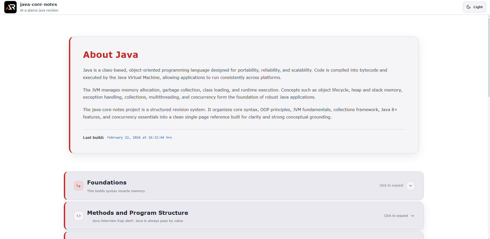

# Java Core Notes

A single-page, at-a-glance revision project for core Java concepts.

This project is designed as a fast reference and structured summary sheet covering essential Java topics without unnecessary depth.  
It focuses on clarity, JVM mental model, real-world usage, and modern Java fundamentals.

---



---

## Purpose

- Quick revision before interviews
- Rapid recall of core Java concepts
- Clear mental model of JVM, memory, and execution flow
- Practical, production-focused reminders
- Strong OOP + Collections + Exception handling foundation without overload

## Coverage

- Java basics and syntax
- Data types, variables, and type casting
- Operators and control flow
- Methods and method overloading
- OOP fundamentals (class, object, inheritance, polymorphism, abstraction, encapsulation)
- Interfaces vs abstract classes
- this and super keyword
- Constructors and initialization
- Static keyword and static blocks
- Access modifiers and packages
- String, StringBuilder, StringBuffer
- Arrays and common patterns
- Wrapper classes and autoboxing
- Exception handling (try/catch/finally, throw/throws, custom exceptions)
- Collections framework (List, Set, Map, Queue)
- Generics basics
- Comparable vs Comparator
- Hashing and equals/hashCode
- Immutability and defensive copying
- Java 8+ essentials (lambda, functional interfaces, streams, optional)
- Stream operations (map, filter, reduce, collect)
- Date and time API (java.time)
- File I/O basics (File, Path, Files)
- Serialization basics
- Multithreading basics (Thread, Runnable)
- Concurrency essentials (synchronized, locks, volatile)
- Executor framework basics
- JVM basics (JRE vs JDK, classloader, heap vs stack, GC basics)
- Common interview traps and best practices

## Tech Stack

- React
- Vite
- styled-components

## Project Type

Single page only  
Section-based navigation  
Searchable and expandable content  
No blog-style content, only structured notes

Each topic is modular and collapsible for fast scanning.

## Run Locally

```bash
npm install
npm run dev
```

## Goal

Complete core Java knowledge in one scrollable page.
No fluff. No repetition. Just essentials.
